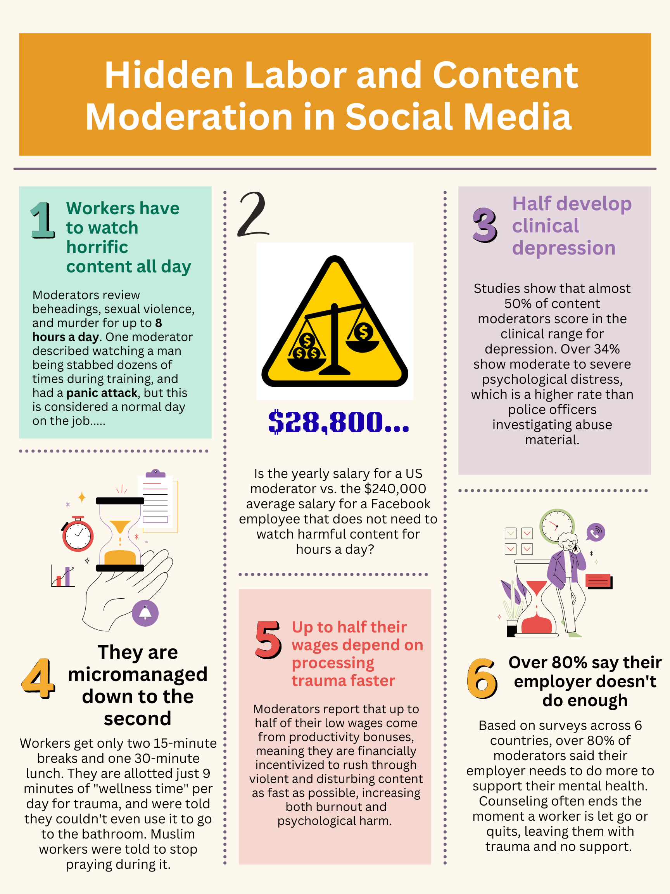

# Harmful Hidden Labor

## The Artifact

## Process Notes
✦ How did you make this? I researched hidden labor in content moderation and turned the most important statistics and worker experiences into a visual infographic.
✦ What tools did you use? I used Canva to design the infographic, including its template and AI image generator.
✦ What decisions did you make? I chose to use bold colors, numbered sections, statistics, and personal worker stories so the information would feel clear, emotional, and easy to understand quickly.

## Reflection
For this project, I researched content moderation, which is the hidden labor of reviewing and removing violent, disturbing, and harmful content from social media platforms so that everyday users never have to see it. My three main sources were Casey Newton's investigative article "The Trauma Floor," published by The Verge in 2019, a 2025 report from UNI Global Union called "The People Behind the Screens," and a peer reviewed academic study by Spence et al. published in the journal Cyberpsychology, Behavior, and Social Networking in 2024.
The Verge article was the most detailed and personal source. It followed real moderators working for Facebook's contractor Cognizant in Phoenix, Arizona, and gave specific facts like the $28,800 yearly salary, the 9 minutes of daily wellness time, and personal stories from workers who developed PTSD after leaving. The UNI Global Union report was useful because it covered moderators across six different countries, which helped show that this is a global problem and not just one company. It also gave me the statistic that up to half of moderators' wages come from productivity bonuses, which means they are financially pressured to rush through traumatic content faster. The Spence et al. study was the most academic source and provided clinical mental health data, including the fact that nearly 50% of moderators scored in the clinical range for depression. In my opinion, the hardest thing to find was consistent wage data, especially for workers outside the United States. Most of that information came from investigative journalism instead of official company reports, which shows how deliberately hidden this labor is. What surprised me most was learning that moderators sign NDAs preventing them from even telling their own families where they work. The secrecy is not just about privacy, it also protects companies from accountability. Making this labor visible felt like the whole point of the assignment.

## Design Statement
I chose to create an infographic rather than a zine because I wanted the information to be immediately accessible and easy to understand at a glance. Infographics are designed to communicate complex information quickly, which felt right for this topic. Most people who use social media have no idea that content moderators exist, let alone what their working conditions are like. I wanted someone to be able to look at my infographic for 30 seconds and walk away knowing something important that they didn't know before. My audience is primarily people my own age, such as college students and young adults who use social media platforms like Facebook, Instagram, and TikTok every day without thinking about the labor that keeps them running. These are people who are comfortable scrolling through content online, so presenting information in a visual, digestible format made the most sense. For my infographic, I chose a bold color scheme and numbered sections to make it feel engaging and not too overwhelming. I also made a deliberate choice to mix statistics with real human stories, like the moderator who had a panic attack during training, because I think numbers alone don't make people feel anything. The combination of data and personal experience is what makes the issue feel real and urgent. What I want my audience to feel after reading this is uncomfortable, but in a productive way. I want them to feel unsettled by the fact that their everyday social media use depends on people being psychologically harmed for low wages. And I want them to start asking questions about who really pays the cost of keeping the internet clean and who profits from it.

## Attribution & AI Use
- Tools used: Canva (infographic, AI image generator, and template)
- Images credited or noted as AI-generated: I did not use any AI generated text, but I did use Canvas AI to create the images for my infographic. No other AI was used for this.
- Sources used: Newton, Casey. "The Trauma Floor." The Verge, 25 Feb. 2019, www.theverge.com/2019/2/25/18229714/cognizant-facebook-content-moderator-interviews-trauma-working-conditions-arizona.
	Spence, Ruth, et al. "Content Moderator Mental Health, Secondary Trauma, and Well-Being: A Cross-Sectional Study." Cyberpsychology, Behavior, and Social Networking, vol. 27, no. 2, Feb. 2024, pp. 149-155, pubmed.ncbi.nlm.nih.gov/38153846.
	"Global Content Moderators Alliance Demands Mental Health Protocols in Tech Supply Chain." UNI Global Union, 19 June 2025, uniglobalunion.org/news/tech-protocols.
